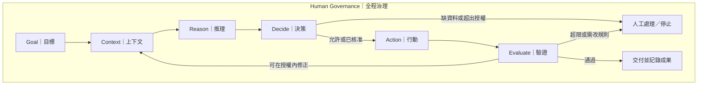

# 方法論完整說明

版本：1.0.0｜2026-09-22

## 1. 唯一主命題

AI to Agent 是把人的工作轉化成 AI 可以理解、判斷、執行、驗證，並全程受到人類治理的企業能力。

一般對話常以回答為交付；Agent 工作則進一步使用工具、管理狀態並檢查任務是否完成。這是工作方式的區別，不代表生成式 AI 不能執行任務，也不代表掛上 Agent 名稱就一定可靠。

企業應先問「要交付什麼、可以授權到哪裡、如何驗證」，再選擇產品。

## 2. 六個工作環節

固定英文：**Goal → Context → Reason → Decide → Action → Evaluate**。  
固定中文：**目標 → 上下文 → 推理 → 決策 → 行動 → 驗證**。

| 環節 | 回答的問題 | 可檢查的產物 |
|---|---|---|
| Goal 目標 | 要完成什麼？ | 工作範圍、交付物、成功條件 |
| Context 上下文 | 需要知道什麼？ | 有來源、時間與使用權限的資料 |
| Reason 推理 | 如何分析？ | 可供檢查的結論、依據及行動方案 |
| Decide 決策 | 採取哪個允許的選項？ | 規則檢查、核准或停止的結果 |
| Action 行動 | 如何執行？ | 工具執行結果、狀態及紀錄 |
| Evaluate 驗證 | 是否符合標準？ | 通過、不通過、待補證據及改善項目 |

六環節是理解工作的共同語言，不強制每次都呼叫六個獨立模組。執行可重複取資料或修正方案；A1 的後續行動由人完成。推理環節要求可驗證的依據與摘要，不要求揭露模型內部思考過程。

閉環並非無限重試。每項任務必須設定重試次數、時間、成本及停止條件。驗證後可以修正執行，但不能自行放寬成功標準、提高自主權或修改企業政策。

## 3. 三個設計工具

| 工具 | 本專案英文名稱 | 工作範圍 | 核心產物 |
|---|---|---|---|
| VAD | Visual Agent Design | 看懂現行工作與預定交接方式 | 人、流程、資料、工具、決策與例外的視覺圖 |
| VAC | Visual Agent Contract | 定義交給 Agent 的任務 | 任務規格與 DC 引用 |
| DC | Decision Contract | 管住任務中的決策 | 條件、依據、權限、人工介入與停止規則 |

以上名稱為本專案用語；Contract 在此指工作約定，不主張其自動構成法律契約。

**VAD 看懂工作 → VAC 定義工作 → DC 管住決策。** 這是設計順序的記憶方式，不是每次執行都要重新填三份文件。VAC 與 DC 分工而且互相引用，不能稱為完全解耦。

VAC 的四個主欄位固定為 Goal、Context、Action、Acceptance（驗收標準）。DC 的四個主欄位固定為 Decision、Criteria、Authority、Escalation。文件編號、版本、負責人及相互引用是管理資料，不是新的方法論層級。

VAC 用引用指定 DC；DC.Authority 記載 A1–A4 與具體授權。自主權不是填完 DC 後又另訂的一套規則。規格與技術設定不一致時，停止受影響行動並由負責人處理。

## 4. 四級自主權

此為本方法論自訂的授權分類，不是業界通用標準。等級用於特定任務或流程，不對整家公司或某個模型打分。

| 等級 | 名稱 | AI 可以做什麼 | 人的責任 |
|---|---|---|---|
| A1 | Assist／輔助 | 提供資料、分析與草稿 | 人決策並執行業務行動 |
| A2 | Approve／核准 | 準備具體行動，取得該次或明確批次核准後執行 | 人審核內容、範圍與核准有效期 |
| A3 | Autonomous／任務自主 | 在預授權的單一任務範圍內判斷與執行 | 人設定邊界，接手例外並稽核 |
| A4 | Orchestrated Autonomy／流程自主 | 在預授權流程內調度多個任務、選擇路徑與分派執行 | 人核准流程邊界、調度範圍並監督整體結果 |

四句記憶：**A1 幫我想；A2 我核准；A3 任務內自主；A4 流程內調度。**

A3 與 A4 的差異是授權範圍。A4 必須列出可以調度的任務、工具及資源上限；即使使用多 Agent，各 Agent 的權限仍不能超出各自 DC。固定腳本串接多個任務也不自動成為 A4，必須實際獲得流程路徑或任務調度的選擇權。

所有等級都有人類治理，A4 不擁有修改自身權限或目標的權力。多 Agent 可以只做 A1 草稿協作；單一 Agent 也可以在獲授權後執行 A4 流程。不同工作可長期停留在適合的等級，不需要一路升級。

## 5. 治理包住設計與執行全程

Human Governance 包含權限、資料使用、責任、政策、人工介入、稽核與變更管理。它不是第七個環節。

治理是全程的制度；核准檢查則可以在具體行動前實作為控制點，兩者並不衝突。DC 記錄規則，實際系統還必須以帳號權限、核准狀態與工具限制落實規則，不能只靠提示詞。

## 6. 驗收、KPI 與成果

**Acceptance 是標準；Evaluate 是依標準檢查的活動；KPI 是其中可量化的指標。**

驗收還包括必要欄位、來源、品質與禁止事項。執行成功不等於任務驗收通過，任務驗收通過也不等於已證明商業效益。例如建立十項任務只是執行結果；正確建立、沒有重複才是驗收；節省處理時間與改善追蹤率需要另行量測。

Business Outcome 是目標中期待、驗證中衡量的結果，不是新增的第七環節。無基準或對照資料時，不宣稱改善是 Agent 造成的。

## 7. Promptless 的位置

Promptless 是減少使用者每次臨時撰寫提示的操作方式：將工作要求固定為可重用、可交接、可治理的規格，再補入當次資料。

它不是沒有指令、不需上下文，也不是三份文件寫好後自然獲得的功能。系統需要載入正確版本的 VAC/DC，填入當次輸入並落實執行控制。

## 8. 技術保持可替換

LLM、規則系統、資料庫、工具與連接協定是實作選項，可以跨多個環節。產品資訊在技術案例頁維護，不用品牌名稱定義方法論。

設計順序最後收斂為：**看懂工作 → 定義任務與決策規則 → 落實授權 → 執行六環節 → 驗證及受控改善**。

AI Coach 益力康陳董 × CGM Coach 血糖教練｜2026 AI to Agent
